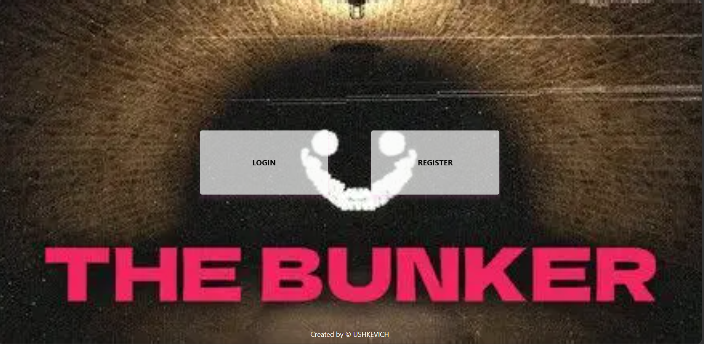
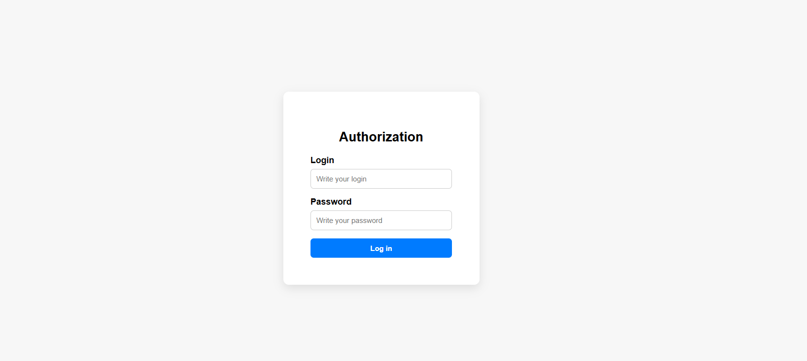
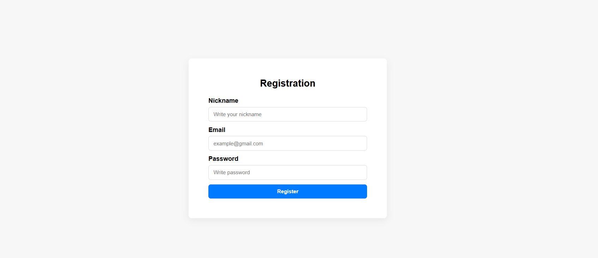
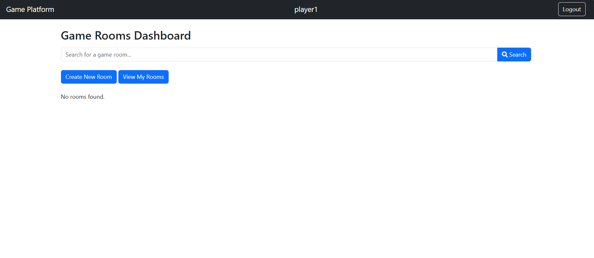
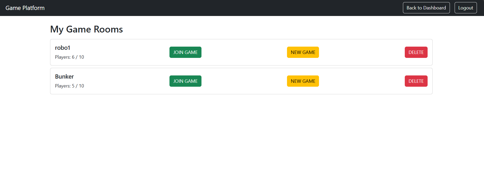
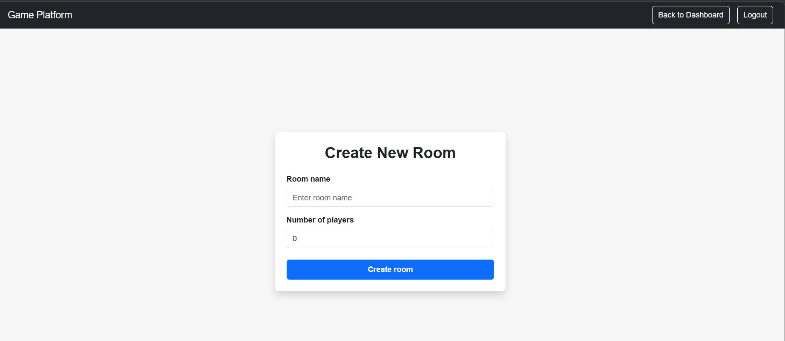
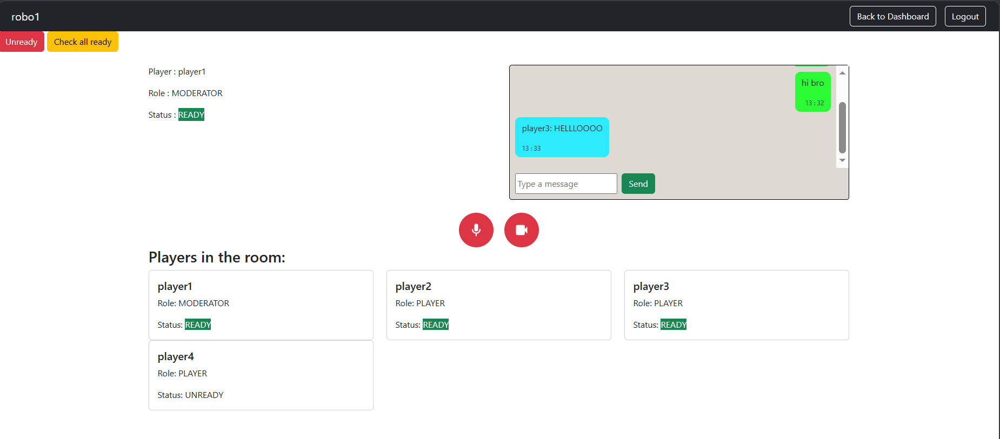
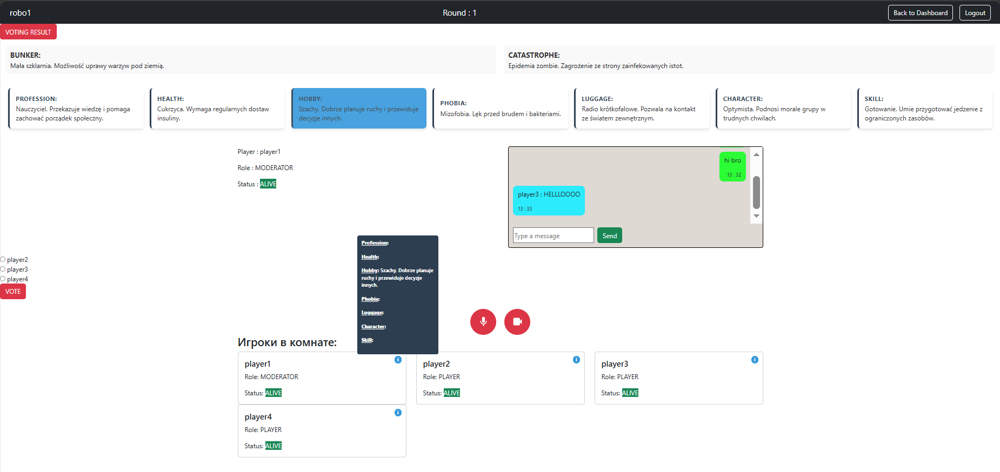
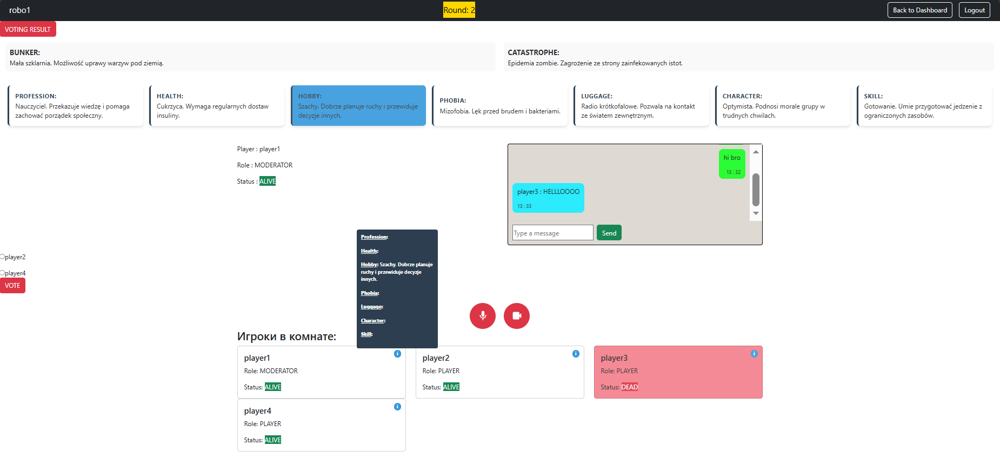
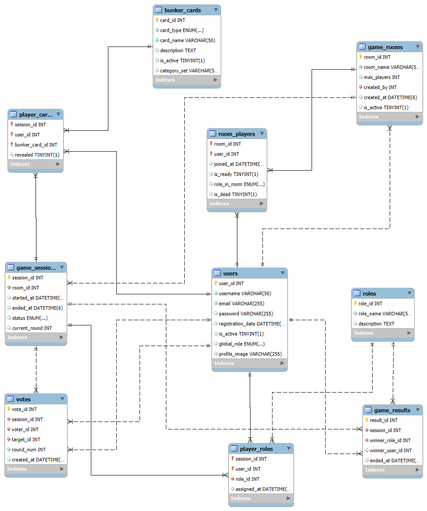

# Team gaming platform

---

**THIS IS NOT THE FINAL VERSION, THIS PROJECT IS IN PROGESS. THE DESCRIPTION WILL BE UPDATED DURING DURING PROGRESS.**

---

<p align="center">
    
    
    
    

    
    


    
    
    
    

    
    
    
    
    
</p>

---

**Team gaming platform** It's a web application for playing team games like “Bunker” in real time. Users can create their own game rooms and communicate by text, video, and voice chat. The app also includes tools to help with the game, such as role selection, game cards.

---

## 📑 Table of Contents
* [Tech Stack](#-tech-stack)
* [Screenshots](#-screenshots)
* [How to Run the Project](#-how-to-run-the-project)
* [Project Structure](#-project-structure)
* [Database Structure](#-database-structure)

---

## 🏗 Tech Stack

* **Java:** 21
* **Spring Boot:** 3.4.11
* **Spring Security, Hibernate, JPA**
* **Apache-Maven:** 4.0.0
* **Database:** MySQL, Redis
* **Frontend:** Thymeleaf, HTML5, CSS3, JavaScript, Bootstrap 
* **WebSocket, LiveKit**

---

## 📸 Screenshots

### 🏠 Welcome page

<p align="center">
  
</p>

---

### 👔 Login page

<p align="center">
  
</p>

---

### 👔 Register page

<p align="center">
  
</p>

---

### 👔 Dashboard page

<p align="center">
  
</p>
<p align="center">
  
</p>

---

### 👔 List of my game rooms

<p align="center">
  
</p>

---

### 👔 Create new game room page

<p align="center">
  
</p>

---

### 👔 Game lobby page

<p align="center">
  
</p>

---

### 👔 Game session page

<p align="center">
  
</p>
<p align="center">
  
</p>

---

## 🚀 How to Run the Project

1.  The manual will be added in the future.

---

## 📂 Project Structure

```
gamingplatform/
│
├── src/
│   ├── main/
│   │   ├── java/com/gamingplatform/
│   │   │   │
│   │   │   ├── config/
│   │   │   │   ├── CustomAuthenticationSuccessHandler.java
│   │   │   │   ├── RedisConfig.java
│   │   │   │   └── WebSecurityConfig.java
│   │   │   │
│   │   │   ├── controller/
│   │   │   │   ├── ChatController.java
│   │   │   │   ├── DashboardController.java
│   │   │   │   ├── GameRoomsController.java
│   │   │   │   ├── GameSessionsController.java
│   │   │   │   ├── HomeController.java
│   │   │   │   ├── LiveKitController.java
│   │   │   │   ├── RoomPlayersController.java
│   │   │   │   └── UsersController.java
│   │   │   │
│   │   │   ├── dto/
│   │   │   │   ├── BunkerCardList.java
│   │   │   │   ├── BunkerCardsDTO.java
│   │   │   │   ├── ChatMessageDTO.java
│   │   │   │   ├── DeadStatus.java
│   │   │   │   ├── GameRoomsDTO.java
│   │   │   │   ├── GameSessionInfo.java
│   │   │   │   ├── MessageType.java
│   │   │   │   ├── PlayerCardsDTO.java
│   │   │   │   ├── ReadyStatus.java
│   │   │   │   ├── RoomPlayersDTO.java
│   │   │   │   ├── ServerMessage.java
│   │   │   │   ├── UserActivityDTO.java
│   │   │   │   ├── UsersDTO.java
│   │   │   │   ├── VoteResult.java
│   │   │   │   └── VotesDTO.java
│   │   │   │
│   │   │   ├── entity/
│   │   │   │   ├── BunkerCards.java
│   │   │   │   ├── CardType.java
│   │   │   │   ├── GameResults.java
│   │   │   │   ├── GameRooms.java
│   │   │   │   ├── GameSessions.java
│   │   │   │   ├── GlobalRole.java
│   │   │   │   ├── PlayerCards.java
│   │   │   │   ├── PlayerCardsId.java
│   │   │   │   ├── PlayerRoles.java
│   │   │   │   ├── PlayerRolesId.java
│   │   │   │   ├── RoleInRoom.java
│   │   │   │   ├── Roles.java
│   │   │   │   ├── RoomPlayers.java
│   │   │   │   ├── RoomPlayersId.java
│   │   │   │   ├── SessionGameStatus.java
│   │   │   │   ├── Users.java
│   │   │   │   └── Votes.java
│   │   │   │
│   │   │   ├── repository/
│   │   │   │   ├── BunkerCardsRepository.java
│   │   │   │   ├── GameResultsRepository.java
│   │   │   │   ├── GameRoomsRepository.java
│   │   │   │   ├── GameSessionsRepository.java
│   │   │   │   ├── PlayerCardsRepository.java
│   │   │   │   ├── PlayerRolesRepository.java
│   │   │   │   ├── RolesRepository.java
│   │   │   │   ├── RoomPlayersRepository.java
│   │   │   │   ├── UsersRepository.java
│   │   │   │   └── VotesRepository.java
│   │   │   │
│   │   │   ├── service/
│   │   │   │   ├── BunkerCardsService.java
│   │   │   │   ├── ChatService.java
│   │   │   │   ├── CustomUserDetailService.java
│   │   │   │   ├── GameProcessService.java
│   │   │   │   ├── GameResultsService.java
│   │   │   │   ├── GameRoomsService.java
│   │   │   │   ├── GameSessionsService.java
│   │   │   │   ├── LiveKitService.java
│   │   │   │   ├── RoomPlayersService.java
│   │   │   │   ├── UsersService.java
│   │   │   │   └── VotesService.java
│   │   │   │
│   │   │   ├── util/
│   │   │   │   └── CustomUserDetails.java
│   │   │   │
│   │   │   ├── websocket/
│   │   │   │   ├── WebSocketConfig.java
│   │   │   │   └── WebSocketService.java
│   │   │   │
│   │   │   └── GamingplatformApplication.java
│   │   │
│   │   └──  resources/
│   │        ├── static/
│   │        │   ├── assets
│   │        │   │   └── bunker-main.webp
│   │        │   ├── css
│   │        │   │   ├── bunker-main.webp
│   │        │   │   ├── bunker-main.webp
│   │        │   │   ├── bunker-main.webp
│   │        │   │   ├── bunker-main.webp
│   │        │   │   ├── bunker-main.webp
│   │        │   │   ├── bunker-main.webp
│   │        │   │   └── bunker-main.webp
│   │        │   │
│   │        │   ├── css
│   │        │   │   ├── font-awesome.min.css
│   │        │   │   ├── new-room.css
│   │        │   │   ├── style.css
│   │        │   │   ├── style-index.css
│   │        │   │   ├── style-login.css
│   │        │   │   └── style-reg.css
│   │        │   │
│   │        │   ├── fonts
│   │        │   │
│   │        │   ├── img
│   │        │   │   ├── camera.svg
│   │        │   │   └── mic.svg
│   │        │   │
│   │        │   └── templates
│   │        │       ├── createRoom.html
│   │        │       ├── dashboard.html
│   │        │       ├── gameRoom.html
│   │        │       ├── gameSession.html
│   │        │       ├── index.html
│   │        │       ├── login.html
│   │        │       ├── registerForm.html
│   │        │       └── roomsList.html
│   │        │
│   │        ├── templates/
│   │        │   ├── createRoom.html
│   │        │   ├── dashboard.html
│   │        │   ├── gameRoom.html
│   │        │   ├── gameSession.html
│   │        │   ├── index.html
│   │        │   ├── login.html
│   │        │   ├── registerForm.html
│   │        │   └── roomsList.html
│   │        │
│   │        ├──  application.properties
│   │        └──  log4j2-spring.xml
│   │
│   └── test/
│       └── java/com/sport_calendar/
│           └── GamingplatformApplicationTests.java
│
├── pom.xml
├── README.md
└── .gitignore
```

---

## 📂 Database structure

<p align="center">
  <a href="./docs/database-structure.png">
    
  </a>
</p>
